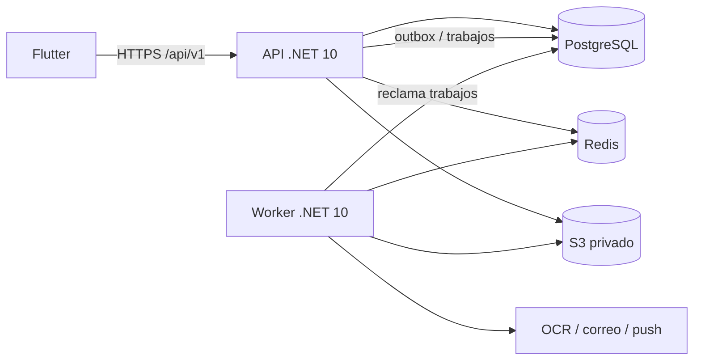

# Arquitectura técnica del backend

## 1. Objetivo y alcance

La arquitectura debe soportar todos los endpoints documentados sin trasladar todavía la complejidad operativa de microservicios al proyecto. La aplicación Flutter nunca debe conectarse directamente a PostgreSQL, Redis o S3; toda autorización y regla de negocio se ejecuta en la API.

La solución se divide por capacidades de negocio:

| Módulo | Responsabilidad |
|---|---|
| `Identidad` | Usuarios, perfil, preferencias, sesiones y contraseñas |
| `Seguridad` | Dispositivos, OTP, biometría, controles de riesgo |
| `FinanzasPersonales` | Cuentas, tarjetas, categorías, movimientos, transferencias y recurrencias |
| `Familia` | Grupos, roles, invitaciones, cuentas compartidas y caja |
| `Documentos` | Archivos, OCR, PDF y XML SIFEN |
| `Analitica` | Dashboard, reportes, alertas, score y predicciones |
| `Suscripciones` | Planes, suscripciones y capacidades habilitadas |
| `Notificaciones` | Preferencias, correos, push y registro de entregas |
| `Auditoria` | Trazabilidad de operaciones sensibles |

## 2. Topología de despliegue



Los despliegues iniciales son `api`, `worker`, `postgres`, `redis` y un proveedor S3. La API atiende solicitudes breves; el Worker procesa:

- OCR y lectura de XML SIFEN;
- exportaciones;
- correo y notificaciones;
- generación de movimientos recurrentes;
- alertas, score y predicciones;
- limpieza de tokens, trabajos y archivos huérfanos.

PostgreSQL funciona inicialmente como cola durable. Una cola externa sólo se incorpora si el volumen, la latencia o la operación lo justifican.

## 3. Estructura propuesta de la solución

```text
backend/
├── FinanzasInteligentes.sln
├── Directory.Build.props
├── src/
│   ├── FinanzasInteligentes.Api/
│   ├── FinanzasInteligentes.Worker/
│   ├── FinanzasInteligentes.BuildingBlocks/
│   ├── FinanzasInteligentes.Persistencia/
│   └── Modulos/
│       ├── Identidad/
│       │   ├── Identidad.Dominio/
│       │   ├── Identidad.Aplicacion/
│       │   ├── Identidad.Infraestructura/
│       │   └── Identidad.Endpoints/
│       └── ...un directorio equivalente por módulo
├── tests/
│   ├── Unitarios/
│   ├── Integracion/
│   ├── Arquitectura/
│   └── Contratos/
└── deploy/
    ├── compose.yaml
    └── env.example
```

Responsabilidades por capa:

- **Dominio:** entidades, objetos de valor, invariantes y eventos de dominio; no referencia EF, HTTP ni proveedores.
- **Aplicación:** casos de uso, comandos, consultas, DTO, autorización por caso de uso y puertos.
- **Infraestructura:** EF Core, Redis, S3, JWT y adaptadores externos.
- **Endpoints:** rutas, binding, códigos HTTP, ProblemDetails y OpenAPI.

Los módulos no acceden directamente a tablas de otro módulo. La interacción síncrona se hace mediante interfaces de aplicación y la asíncrona mediante eventos almacenados en outbox.

`FinanzasInteligentes.Persistencia` es el ensamblado técnico que compone el `DbContext`, las configuraciones de todos los módulos y el historial de migraciones; no contiene reglas de negocio.

## 4. Persistencia

### 4.1 DbContext y esquemas

Para la primera versión se utiliza un solo `FinanzasDbContext` y un historial lineal de migraciones. Esto permite que un movimiento, una transferencia o una operación de caja sean atómicos incluso cuando afectan varias tablas.

Las configuraciones `IEntityTypeConfiguration<T>` se agrupan por módulo y asignan estas tablas:

| Esquema | Propietario |
|---|---|
| `identidad` | Identidad |
| `seguridad` | Seguridad |
| `finanzas` | FinanzasPersonales |
| `familia` | Familia |
| `documentos` | Documentos |
| `analitica` | Analitica |
| `suscripciones` | Suscripciones |
| `notificaciones` | Notificaciones |
| `auditoria` | Auditoria |
| `infra` | Idempotencia, outbox y trabajos |

No se recomienda un `DbContext` por módulo durante esta etapa: complicaría migraciones y transacciones sin aportar aislamiento operativo real. La separación futura sigue siendo posible porque los esquemas y propietarios ya están definidos.

### 4.2 Convenciones de datos

- nombres físicos en `snake_case`;
- claves `uuid`, creadas como UUID v7 en .NET;
- fecha/hora `timestamptz` y siempre UTC;
- fecha civil `date`;
- moneda ISO 4217 en `char(3)`;
- importes PYG en `bigint`;
- porcentajes y confianza en `numeric(8,6)`;
- documentos variables controlados en `jsonb`;
- correo en `citext`;
- concurrencia optimista con columna `version bigint`;
- `creado_en` y `actualizado_en` en entidades mutables;
- `eliminado_en` sólo donde el borrado lógico tiene valor real.

Los registros contables, operaciones de caja y auditoría son inmutables. Un error se corrige con anulación o movimiento compensatorio, conservando su relación con el original.

### 4.3 Saldos y valores derivados

| Dato | Estrategia |
|---|---|
| Saldo de cuenta | Snapshot en `finanzas.cuentas`, actualizado en la misma transacción que el movimiento |
| Saldo de caja | Snapshot en `familia.cajas`, actualizado junto con la operación inmutable |
| Gasto de presupuesto | Calculado desde movimientos confirmados; no se guarda un contador editable |
| Progreso de meta | Suma de aportes válidos; puede cachearse |
| Dashboard y reportes | Consulta o caché Redis; PostgreSQL sigue siendo la fuente de verdad |
| Score y predicción | Snapshot versionado generado por Worker |

Las actualizaciones de saldos bloquean la fila de cuenta o caja dentro de la transacción para evitar sobregiros concurrentes.

## 5. Transacciones y consistencia

### 5.1 Límites transaccionales

- **Movimiento:** insertar movimiento, actualizar saldo, asociar categorías/documento y escribir outbox.
- **Transferencia:** insertar transferencia y sus dos movimientos vinculados, actualizar ambos saldos y escribir outbox.
- **Aporte o retiro de caja:** validar OTP cuando corresponda, insertar operación, actualizar caja/cuenta y escribir auditoría/outbox.
- **Aporte a meta:** insertar aporte y, si existe una cuenta origen, crear el movimiento correspondiente en la misma transacción.
- **Invitación aceptada:** consumir token y crear membresía de manera atómica.

Alertas, notificaciones, dashboard, score, proyecciones y exportaciones se actualizan después mediante eventos. Su retraso no revierte la operación financiera principal.

### 5.2 Patrón outbox

La misma transacción del cambio de negocio agrega un registro a `infra.outbox_eventos`. El Worker:

1. reclama un lote con `FOR UPDATE SKIP LOCKED`;
2. ejecuta los consumidores idempotentes;
3. marca el evento como procesado;
4. reintenta con espera exponencial;
5. mueve los fallos permanentes a estado `fallido`.

No se publica un evento antes de confirmar la transacción. Cada consumidor conserva una clave de deduplicación cuando pueda producir efectos externos.

## 6. Seguridad

- access token JWT de 10 a 15 minutos;
- refresh token aleatorio, rotativo y almacenado sólo como hash;
- contraseñas con Argon2id o el `PasswordHasher` vigente de ASP.NET Core, nunca cifrado reversible;
- OTP y tokens de invitación/recuperación almacenados como hash;
- secretos únicamente en variables de entorno o secret manager;
- rate limiting por IP, usuario y propósito;
- autorización familiar comprobada en cada caso de uso;
- URLs S3 prefirmadas y de corta duración;
- cifrado TLS en tránsito y cifrado gestionado por proveedor en reposo;
- auditoría sin contraseñas, tokens, OTP ni contenido binario.

La conexión PostgreSQL usada por la API no se entrega al cliente. Si se usa Supabase como hosting, las claves `service_role` permanecen sólo en backend y los roles públicos no reciben acceso directo a los esquemas.

## 7. Idempotencia y concurrencia

Las rutas indicadas en [`CONVENCIONES.md`](../api/CONVENCIONES.md) requieren `Idempotency-Key`. La API guarda el hash canónico de la solicitud y su resultado:

- misma clave y mismo cuerpo: devuelve el resultado anterior;
- misma clave y cuerpo diferente: `409 Conflict`;
- operación todavía en proceso: `409 Conflict` con código `idempotencia_en_proceso`;
- claves vencidas: se eliminan por Worker según la retención.

El `ETag` expone `version`. Un `If-Match` desactualizado produce `412 Precondition Failed`; la actualización SQL incluye `WHERE id = @id AND version = @version`.

## 8. Archivos y procesos

La carga crea primero metadatos en PostgreSQL y luego confirma el objeto privado en S3. El nombre de objeto es opaco y no contiene datos personales. Se registra SHA-256 para integridad y deduplicación.

Estados documentales:

```text
pendiente -> cargando -> disponible -> procesando -> completado
                    \-> fallido       \-> incompleto / fallido
```

Si una transacción falla después de cargar un objeto, un trabajo de limpieza elimina el archivo huérfano. Nunca se guarda un archivo completo en PostgreSQL.

## 9. Observabilidad y operación

- logs JSON con `correlationId`, `usuarioId` pseudonimizado, módulo y duración;
- OpenTelemetry para trazas y métricas;
- health checks separados: `/salud/vivo` y `/salud/listo`;
- métricas de latencia, errores, conexiones, cola pendiente, reintentos y tiempo de OCR;
- `ProblemDetails` uniforme y sin detalles internos;
- backups automáticos de PostgreSQL y prueba periódica de restauración;
- migraciones aplicadas por un job de despliegue, no por cada réplica de API al iniciar.

## 10. Pruebas obligatorias

| Tipo | Qué valida |
|---|---|
| Unitarias | Invariantes, permisos, cálculos y transiciones de estado |
| Integración | EF Core contra PostgreSQL real mediante contenedor |
| Contrato | Rutas, JSON, códigos y ProblemDetails de `docs/api` |
| Arquitectura | Dependencias permitidas y propiedad de módulos |
| Concurrencia | Idempotencia, ETag, doble gasto y aceptación doble de invitación |
| Seguridad | Acceso entre usuarios/grupos, expiración, rotación y rate limit |
| Migraciones | Base vacía a última versión y actualización desde la versión anterior |

SQLite no sustituye PostgreSQL en pruebas de integración porque no reproduce `citext`, índices parciales, `jsonb`, bloqueos ni semántica de concurrencia.

## 11. Criterios para extraer un microservicio

No se separa un módulo por anticipación. La extracción se evalúa sólo si aparecen uno o más motivos medibles:

- carga o escalado muy diferente;
- requisitos propios de disponibilidad o cumplimiento;
- equipo independiente y ciclos de despliegue distintos;
- tecnología de persistencia realmente diferente;
- fallos de ese módulo afectan al resto con frecuencia.

Los primeros candidatos serían Documentos/OCR, Notificaciones y Analítica. Identidad sólo se separaría si se adopta un proveedor o servicio de identidad dedicado.
